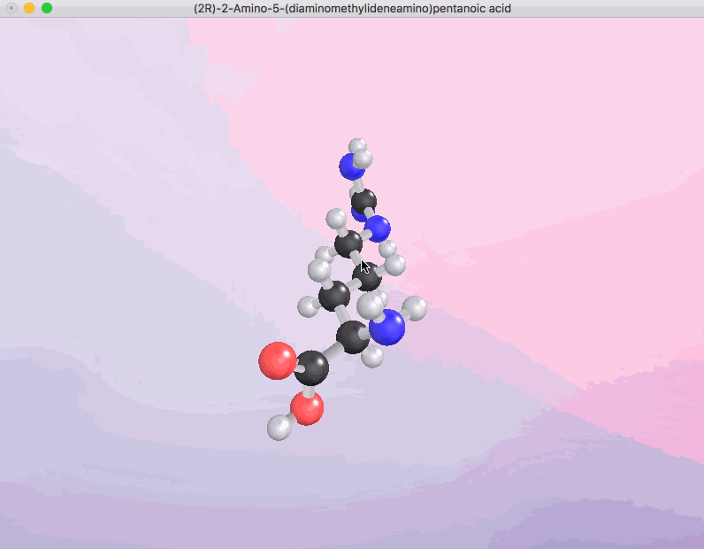

opengl-molecules
================

## Screenshot



## Installation

You have to install `libSOIL` by doing the following:

``` sh
git clone https://github.com/smibarber/libSOIL
cd libSOIL
make
sudo make install
```

All other dependencies are included in this repo.

## Usage

To compile and run:

``` sh
make
```

## License

MIT
